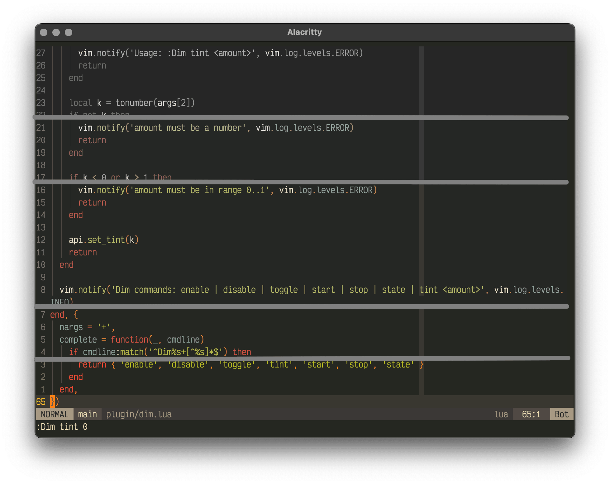

# **dim.nvim**

A time-based color dimming engine for Neovim.

`dim.nvim` gradually desaturates and compresses the contrast of your existing colorscheme, making Neovim visually “less attractive” outside working hours — without changing the colorscheme itself.

It works like **f.lux / Night Shift**, but for your editor.

______________________________________________________________________

## Features

- Works with any colorscheme
- Preserves your theme — no switching
- Smooth time-based dimming
- Fully reversible
- Supports manual and automatic modes
- Lua override hooks (weekends, holidays, focus mode, etc.)
- Works with lualine, file trees, LSP highlights, etc.

______________________________________________________________________

## Preview



## Installation

### lazy.nvim

```lua
{
  "ademkin/dim.nvim",
  lazy = false,
  priority = 1000,  -- load with colorscheme to prevent flicker
  ---@type DimOpts
  opts = {
    enabled = true,
    schedule = {
      ["06:00"] = 1.0,
      ["08:00"] = 0.0,
      ["16:00"] = 0.0,
      ["20:00"] = 1.0,
    },
  }
}
```

### packer.nvim

```lua
use {
  "ademkin/dim.nvim",
  config = function()
    ---@type DimOpts
    require("dim").setup({
      enabled = true,
      schedule = {
        ["06:00"] = 1.0,
        ["08:00"] = 0.0,
        ["16:00"] = 0.0,
        ["20:00"] = 1.0,
      },
    })
  end
}
```

______________________________________________________________________

## Quick start (manual mode)

You can use dim.nvim without any configuration:

```lua
{
  "ademkin/dim.nvim",
  lazy = false,
  priority = 1000,  -- load with colorscheme to prevent flicker
  config = function()
    vim.cmd('Dim tint 0.5')
  end,
}
```

This applies a static dim (0 = none, 1 = maximum).

______________________________________________________________________

## Time-based schedule

Automatically increase dimming in the evening:

```lua
---@type DimOpts
opts = {
  enabled = true,
  schedule = {
    ["06:00"] = 1.0,
    ["08:00"] = 0.0,
    ["16:00"] = 0.0,
    ["18:00"] = 0.7,
    ["20:00"] = 1.0,
  },
}
```

The dim level will smoothly interpolate between those values during the day.

______________________________________________________________________

## Override

Overrides in `dim.nvim` are **filters**.
They receive the current dim value (from the schedule) and may return a modified one.

Signature:

```lua
---@type Override
override = function(amount)
  return new_amount or nil
end
```

If the function returns:

- a number → it replaces the current dim
- `nil` → the current dim is kept

Example: shift minimum dimming on weekends

```lua
---@type DimOpts
opts = {
  enabled = true,
  schedule = {
    ["06:00"] = 1.0,
    ["08:00"] = 0.0,
    ["16:00"] = 0.0,
    ["20:00"] = 1.0,
  },
  ---@type Override
  override = function(amount)
    local day = os.date("%A")
    if day == "Saturday" or day == "Sunday" then
      return math.max(amount, 0.5)
    end
  end,
}
```

Example: Force maximum dim on weekend

```lua
---@type DimOpts
opts = {
  enabled = true,
  schedule = {
    ["06:00"] = 1.0,
    ["08:00"] = 0.0,
    ["16:00"] = 0.0,
    ["20:00"] = 1.0,
  },
  ---@type Override
  override = function()
    local day = os.date("%A")
    if day == "Saturday" or day == "Sunday" then
      return 1.0
    end
  end,
}
```

______________________________________________________________________

## Update Interval

By default plugin run updates once a minute. You can adjust it:

```lua
---@type DimOpts
opts = {
  enabled = true,
  update_interval = 1000, -- once a second
  schedule = {
    ["06:00"] = 1.0,
    ["08:00"] = 0.0,
    ["16:00"] = 0.0,
    ["20:00"] = 1.0,
  },
}
```

______________________________________________________________________

## Commands

| Command | Description |
| ------------------ | ----------------------- |
| `:Dim enable` | Enable dimming |
| `:Dim disable` | Disable dimming |
| `:Dim toggle` | Toggle on/off |
| `:Dim tint {0..1}` | Apply static dim |
| `:Dim start` | Start scheduled dimming |
| `:Dim stop` | Stop scheduled dimming |
| `:Dim state` | Show internal state |

______________________________________________________________________

## How it works

dim.nvim transforms all highlight colors in-place using a perceptual grayscale + contrast compression model.

It does **not**:

- change your colorscheme
- define new highlight groups
- touch your config files

It only mutates colors at runtime and can always restore the original values.

______________________________________________________________________

## Philosophy

Working late is often encouraged by beautiful UIs.
dim.nvim makes Neovim visually boring when it should be.

Your brain notices.
